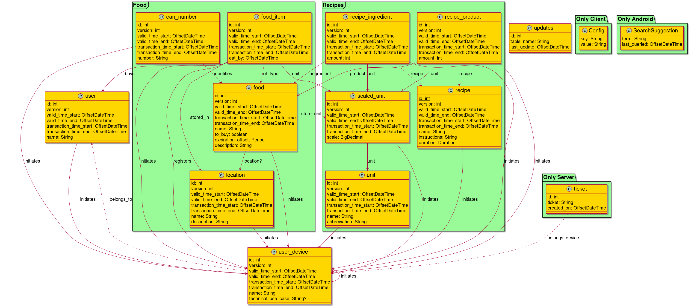

# Stocks Specification

## Data Model



## Architecture

### Client

Here interesting use cases for clients interacting with the server are
described.

#### Registering a New Data Item


#### Refreshing the Client Database


#### New Users' Registration

New users are always added by giving a ticket from an existing user. The details
are outlined in the diagram.


##### Principal Names

In the CSR the user stores the principals of his device. The values are
formatted inside the Common Name attribute of the CSR. The pattern is
`username$user_id$devicename$device_id`. So for the default test user this
resolves to `Jack$1$Device$1`. The principals are checked in the sentry part of
the server before the certificate is signed.

##### Client Verification

Upon receiving a new device registration request, the sentry performs the
following checks in order:

* Check if the ticket value presented by the client is found in the database

* Check the device id associated with the ticket from the database with the
  device id from the CSR

* Check if the remaining principals of the device match the CSR

* Check if the ticket has expired

If all the checks succeed the sentry has the CSR signed by the CA and returns it
to the client.

##### QR Code Tickets

For mobile clients it is more convenient to pass the ticket as QR code. To
generate this QR code the content of the ticket has to be entered text into the
QR code. The order of the values is the same as in the diagram description, i.e.

```
Username
Device name
User ID
Device ID
CA Fingerprint
Ticket
hostname
ca port
registration port
server port
```

So for the default test user this resolves to

```
Jack
Device
1
1
<some FPR>
0000
stocks.example
10910
10911
10912
```

#### Device Removal


## REST API

Get the server's API as [OpenAPI specification](https://spec.openapis.org/oas/latest.html)
at `common/src/main/resources/api/openapi-spec.yaml`.


## License

Copyright (C)  2019  The stocks developers

Permission is granted to copy, distribute and/or modify this document
under the terms of the GNU Free Documentation License, Version 1.3
or any later version published by the Free Software Foundation;
with no Invariant Sections, no Front-Cover Texts, and no Back-Cover Texts.
A copy of the license is included in the section entitled "GNU
Free Documentation License".

