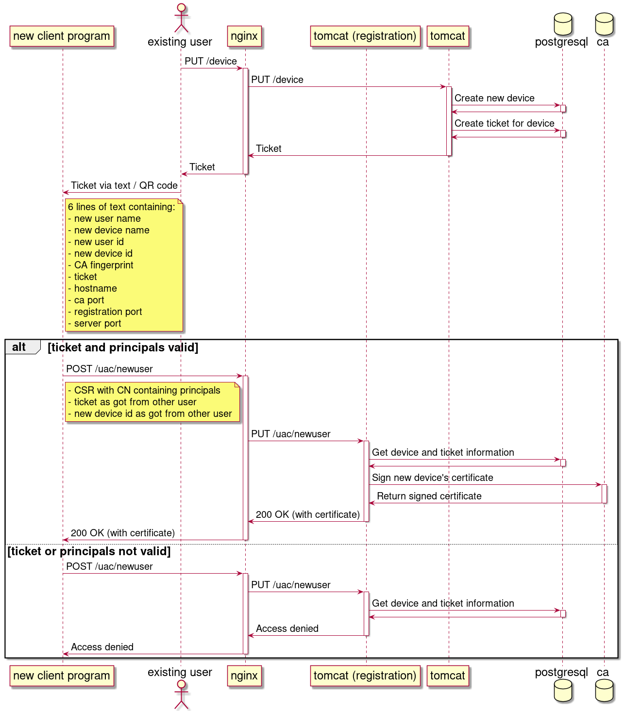

# Stocks Specification

## Data Model


### Date Timezones

| Place           | Format    |
|:---------------:|:---------:|
| Client code     | Localtime |
| Client database | UTC       |
| Network         | UTC       |
| Server code     | UTC       |
| Server database | UTC       |

## Architecture

### Client

Here interesting use cases for clients interacting with the server are
described.

#### Registering a New Data Item


#### Refreshing the Client Database


#### New Users' Registration

New users are always added by giving a ticket from an existing user. The details
are outlined in the diagram.



##### Principal Names

In the CSR the user stores the principals of his device. The values are
formatted inside the Common Name attribute of the CSR. The pattern is
`username$user_id$devicename$device_id`. So for the default test user this
resolves to `Jack$1$Device$1`. The principals are checked in the sentry part of
the server before the certificate is signed.

##### Client Verification

Upon receiving a new device registration request, the sentry performs the
following checks in order:

* Check if the ticket value presented by the client is found in the database

* Check the device id associated with the ticket from the database with the
  device id from the CSR

* Check if the remaining principals of the device match the CSR

* Check if the ticket has expired

If all the checks succeed the sentry has the CSR signed by the CA and returns it
to the client.

##### QR Code Tickets

For mobile clients it is more convenient to pass the ticket as QR code. To
generate this QR code the content of the ticket has to be entered text into the
QR code. The order of the values is the same as in the diagram description, i.e.

```
Username
Device name
User ID
Device ID
CA Fingerprint
Ticket
```

So for the default test user this resolves to

```
Jack
Device
1
1
<some FPR>
0000
```

#### Device Removal


## REST API

List of all available endpoints, methods, their parameters and result types.
Only `v2` endpoints are listed as their usage is strongly encouraged.

Response type schemas are indicated in a pseudo JSON notation. The anonymous
object ontop of each description is the root object. Any further types used
in that root object are described in "Common Data Structures" or directly
behind the root object.

### Common Data Types

#### Versions

Each entity in the system has a version which is incremented each time the
entity is edited. This means all modifying operations have to pass the correct
version of the entity to edit. If the version does not match an error is
returned using status codes, see "Status Codes" for a list of status codes
to support.

#### Valid Time

Each entity in the database is tagged with information about when it was present
in the given state. This interval of validity is encoded using two timestamps,
`validTimeStart` and `validTimeEnd`. The interval contains the starting
timestamp while the ending timestamp is the first moment which is no longer
included (closed-open notation, `[start, end)` using mathematical notation). See
also the `bitemporal` flag.

#### Transaction Time

Each entity in the database is tagged with information about when the
information of the entity was entered into the database. This allows for
reconstruction of past states of the database. This interval of validity is
encoded using two timestamps, `transactionTimeStart` and `transactionTimeEnd`.
The interval contains the starting timestamp while the ending timestamp is the
first moment which is no longer included (closed-open notation, `[start, end)`
using mathematical notation). See also the `bitemporal` flag.

#### Change Initiators

Each entity record in the database stores, which user device initiated
that change. This is indicated by the `initiates` field, which is only
present if `bitemporal` data is requested, just as the timestamps
described before.

#### Status Codes

Numbers reporting the result status of a request. The API refers to this
via the `StatusCode` type.

* `0`: Success

* `1`: General error

* `2`: Not found

* `3`: Invalid data version

* `4`: Foreign key constraint violation

* `5`: Database unreachable

* `6`: Access denied

* `7`: Invalid argument

* `8`: Certificate authority unreachable

#### Timestamps

The timestamp format used is `yyyy.MM.dd-HH:mm:ss.SSSSSS-Z`. Refer to
[the Java API Reference](https://docs.oracle.com/javase/8/docs/api/java/time/format/DateTimeFormatter.html)
for semantics. The timestamps are passed as strings.

The special date `+292278994.08.16-23:00:00.000000-+0000` is used in valid time
to denote _infinity_ and in transaction time to denote _now_. It corresponds
to 9223372036825200000 milliseconds since epoch.

#### Response

Most calls only return a basic response with a status code. They have the
following shape:

```
Response {
    status: StatusCode
}
```

### Prometheus

Tomcat exposes Prometheus metrics on the path `/stocks/metrics`. It gives
information about request durations, circuit breaker events and command retries
due to serialisation conflicts.

### Sentry

Endpoints listed here are only reachable via the sentry port. No client
certificate has to be presented here.

#### Health

`GET /stocks/health`: Inform about server health

It performs one test for DB connectivity and one for CA availability.

Result: `application/json`

```
{
    status: StatusCode
    data: Health
}

Health {
    database: boolean
    ca: boolean
}
```

#### User registration

`POST /v2/auth/newuser`: Register new device

Form parameters:

* `device: int` The id of the device which wants to register

* `token: String` The token generated when creating the new device

* `csr: String` The PEM X.509 Certificate Signing Request generated by the device

Result: `application/json`

```
{
    status: StatusCode
    data: String // PEM X.509 certificate signed by the stocks CA
}
```

### Server

#### Updates

`GET /v2/update`: Get change timestamps of entities

No parameters

Result: `application/json`

```
{
    status: StatusCode
    data: List<Update>
}

Update {
    table: String
    lastUpdate: Timestamp // yyyy.MM.dd-HH:mm:ss.SSS-Z
}
```

Contained table names are:

* `User_device`
* `User`
* `Food`
* `Location`
* `Food_item`
* `EAN_number`
* `unit`
* `scaled_unit`
* `recipe`
* `recipe_ingredient`
* `recipe_product`

The developers present their apologies for the inconsistent casing.

#### Users

`GET /v2/user`: Get all users in the system

Query parameters:

* `bitemporal: int`: Set to 1 to include bitemporal data. 0 yields the
  current state of the data as best known.

* `startingFrom: Timestamp`: Only include the latest changes to the
  data since `startingFrom`. For useful interpretation of the data
  `bitemporal` SHOULD be set to 1.

Result: `application/json`

```
{
    status: StatusCode
    data: List<User>
}

User {
    id: int
    version: int
    name: String
}
```

`PUT /v2/user`: Add a new user into the system

Query parameters:

* `name: String` The name of the new user

Result: `application/json`, `Response`

`DELETE /v2/user`: Delete a user and all their devices from the system.
The calling user is set on all food items registered by the deleted devices.
Access to the system is revoked for all devices of the deleted user.

Query parameters:

* `id: int` The ID of the user to delete

* `version: int` The current version of the user to be deleted

Result: `application/json`, `Response`

#### Devices

`PUT /v2/device`: Create a new device in the system. This query yields
both the ID of the newly created device as well as the ticket token needed to
register at the sentry.

Query parameters:

* `name: String` The name of the new device

* `belongsTo: int` The user ID of the user to whom the device belongs

Result: `application/json`

```
{
    status: StatusCode
    data: ClientTicket
}

ClientTicket {
    deviceId: int    // Device ID
    ticket: String
}
```

`GET /v2/device`: Get all devices in the system

Query parameters:

* `bitemporal: int`: Set to 1 to include bitemporal data. 0 yields the
  current state of the data as best known.

* `startingFrom: Timestamp`: Only include the latest changes to the
  data since `startingFrom`. For useful interpretation of the data
  `bitemporal` SHOULD be set to 1.

Result: `application/json`

```
{
    status: StatusCode
    data: List<Device>
}

Device {
    id: int
    version: int
    name: String
    userId: int   // User ID
}
```

`DELETE /v2/device`: Delete a device from the system.
Access to the system is revoked for that device. The caller
is set on all food items that have been registered by the deleted
device.

Query parameters:

* `id: int`: The ID of the device to be deleted

* `version: int`: The version of the device to be deleted

Result: `application/json`, `Response`

#### Food

`PUT /v2/food`: Add a food type to the system.

Query parameters:

* `name: String`: The name of the new food type

* `unit: int`: The ID of the scaled unit of the new food type. If
  omitted an undefined unit is assigned.

Result: `application/json`, `Response`

`GET /v2/food`: Get all food types in the system.

Query parameters:

* `bitemporal: int`: Set to 1 to include bitemporal data. 0 yields the
  current state of the data as best known.

* `startingFrom: Timestamp`: Only include the latest changes to the
  data since `startingFrom`. For useful interpretation of the data
  `bitemporal` SHOULD be set to 1.

Result: `application/json`

```
{
    status: StatusCode
    data: List<Food>
}

Food {
    id: int
    version: int
    name: String
    toBuy: boolean
    expirationOffset: int
    location: int
    description: String
}
```
`PUT /v2/food/rename`: Edit an existing food type.

Query parameters:

* `id: int`: The ID of the food type to rename

* `version: int`: The version of the food type

* `new: String`: The name to which the food type shall be renamed

* `expirationoffset: int`: The number of days to use as default offset for
  the expiration date of new items. If omitted, this value won't be changed.

* `location: int`: The default location where new food items will be placed in.
  Pass 0 for unsetting the default location. If omitted this value won't be
  changed.

Result: `application/json`, `Response`

`PUT /v2/food/edit`: Edit an existing food type.

Query parameters:

* `id: int`: The ID of the food type to rename

* `version: int`: The version of the food type

* `new: String`: The name to which the food type shall be renamed

* `expirationoffset: int`: The number of days to use as default offset for
  the expiration date of new items. If omitted, this value won't be changed.

* `location: int`: The default location where new food items will be placed in.
  Pass 0 for unsetting the default location. If omitted this value won't be
  changed.

Form parameters:

* `description: String`: The new description to set. If omitted this value won't
  be changed.

Result: `application/json`, `Response`

`PUT /v2/food/buy`: Set the buy status of an existing food

Query parameters:

* `id: int`: The ID of the food type to rename

* `version: int`: The version of the food type

* `buy: int`: Set to 1 if the food is on the shopping list, 0 otherwise.

Result: `application/json`, `Response`

`POST /v2/food/description`: Set the description of an existing food

Query parameters:

* `id: int`: The ID of the food type to rename

* `version: int`: The version of the food type

Form parameters:

* `description: String`: The new description to set

Result: `application/json`, `Response`

`DELETE /v2/food`: Delete a food type. This also deletes all food
items of this type.

Query parameters:

* `id: int` The ID of the food type to delete

* `version: int` The version of the food type to delete

Result: `application/json`, `Response`

#### Locations

`PUT /v2/location`: Add a new location into the system.

Query parameters:

* `name: String`: The name of the new location

Result: `application/json`, `Response`

`GET /v2/location`: Get the locations of the system.

Query parameters:

* `bitemporal: int`: Set to 1 to include bitemporal data. 0 yields the
  current state of the data as best known.

* `startingFrom: Timestamp`: Only include the latest changes to the
  data since `startingFrom`. For useful interpretation of the data
  `bitemporal` SHOULD be set to 1.

Result: `application/json`

```
{
    status: StatusCode
    data: List<Location>
}

Location {
    id: int
    version: int
    name: String
    description: String
}
```

`PUT /v2/location/rename`: Rename an existing location.

Query parameters:

* `id: int`: The ID of the location to rename

* `version: int`: The version to rename

* `new: String`: The new name of the location

Result: `application/json`, `Response`

`POST /v2/location/description`: Set the description of an existing location

Query parameters:

* `id: int`: The ID of the location type to rename

* `version: int`: The version of the location type

Form parameters:

* `description: String`: The new description to set

Result: `application/json`, `Response`

`DELETE /v2/location`: Delete a location. Deleting a location containing
food items is restricted by default, raising status code 4. When setting the
cascade flag, the items stored in that location will be deleted as well.

Query parameters:

* `id: int`: The ID of the location to delete

* `version: int`: The version to delete

* `cascade: int`: Set to 1 to delete all food items contained
  in the location as well.

Result: `application/json`, `Response`

#### EAN Numbers

`PUT /v2/ean`: Add a new EAN code to the system.

Query parameters:

* `code: String`: The EAN code to register

* `identifies: int`: The Food type ID the code shall be associated
  with.

Result: `application/json`, `Response`

`GET /v2/ean`: Get the EAN codes of the system.

Query parameters:

* `bitemporal: int`: Set to 1 to include bitemporal data. 0 yields the
  current state of the data as best known.

* `startingFrom: Timestamp`: Only include the latest changes to the
  data since `startingFrom`. For useful interpretation of the data
  `bitemporal` SHOULD be set to 1.

Result: `application/json`
```
{
    status: StatusCode
    data: List<EanNumber>
}

EanNumber {
    id: int
    version: int
    eanCode: String
    identifiesFood: int	    // Food ID
}
```

`DELETE /v2/ean`: Delete an EAN Code from the system.

Query parameters:

* `id: int`: The ID of the EAN code to delete

* `version: int`: The version of the EAN code to delete

Result: `application/json`, `Response`

#### Food Items

`PUT /v2/fooditem`: Put a new food item into the system.

Query parameters:

* `eatByDate: Timestamp`: The date by which the item should be
  consumed.

* `storedIn: int`: The ID of the location to store the item in

* `ofType: int`: The ID of the food type to which the item belongs

* `unit: int`: The ID of the scaled unit of this item. If omitted an
  undefined unit is assigned.

Result: `application/json`, `Response`

`GET /v2/fooditem`: Get all the food items in the system

Query parameters:

* `bitemporal: int`: Set to 1 to include bitemporal data. 0 yields the
  current state of the data as best known.

* `startingFrom: Timestamp`: Only include the latest changes to the
  data since `startingFrom`. For useful interpretation of the data
  `bitemporal` SHOULD be set to 1.

Result: `application/json`

```
{
    status: StatusCode
    data: List<FoodItem>
}

FoodItem {
	id: int
	version: int
	eatByDate: Timestamp
	storedIn: int         // Location ID
	ofType: int           // Food ID
	registers: int        // Device ID
	buys: int             // User ID
	unit: int             // Unit ID
}

```

`PUT /v2/fooditem/edit`: Edit an existing food item.

Query parameters:

* `id: int`: The ID of the food item to edit

* `version: int`: The version of the food item to edit

* `eatByDate: Timestamp`: The new date by which the item should be
  consumed

* `storedIn: int`: The ID of the new location to store the item in

* `unit: int`: The ID of the new scaled unit of this item. If omitted
  the value is unchanged.

Result: `application/json`, `Response`

`DELETE /v2/fooditem`: Delete a food item.

Query parameters:

* `id: int`: The ID of the food item to delete

* `version: int`: The version of the food item to delete

Result: `application/json`, `Response`

#### Units

`PUT /v2/unit`: Create a new unit of measure in the system.

Query parameters:

* `name: String`: The name of the new unit

* `abbreviation: String`: The abbreviation used for this measure

Result: `application/json`, `Response`

`GET /v2/unit`: Get all units in the system

Query parameters:

* `bitemporal: int`: Set to 1 to include bitemporal data. 0 yields the
  current state of the data as best known.

* `startingFrom: Timestamp`: Only include the latest changes to the
  data since `startingFrom`. For useful interpretation of the data
  `bitemporal` SHOULD be set to 1.

Result: `application/json`

```
{
    status: StatusCode
    data: List<Unit>
}

Unit {
	id: int
	version: int
	name: String
	abbreviation: String
}

```

`PUT /v2/unit/rename`: Rename an existing unit.

Query parameters:

* `id: int`: The ID of the unit to rename

* `version: int`: The version to rename

* `name: String`: The new name of the unit

* `abbreviation: String`: The new abbreviation of the unit

Result: `application/json`, `Response`

`DELETE /v2/unit`: Delete a unit. Deleting a unit used by a scaled unit is
restricted by default, raising status code 4.

Query parameters:

* `id: int`: The ID to delete

* `version: int`: The version to delete

Result: `application/json`, `Response`

#### Scaled Units

`PUT /v2/scaled-unit`: Create a new scaled unit of measure in the system.

Query parameters:

* `scale: BigDecimal`: The string representation of a BigDecimal

* `unit: int`: The unit scaled by this scaled unit

Result: `application/json`, `Response`

`GET /v2/scaled-unit`: Get all scaled units in the system

Query parameters:

* `bitemporal: int`: Set to 1 to include bitemporal data. 0 yields the
  current state of the data as best known.

* `startingFrom: Timestamp`: Only include the latest changes to the
  data since `startingFrom`. For useful interpretation of the data
  `bitemporal` SHOULD be set to 1.

Result: `application/json`

```
{
    status: StatusCode
    data: List<ScaledUnit>
}

ScaledUnit {
	id: int
	version: int
	scale: BigDecimal
	unit: int
}

```

`PUT /v2/scaled-unit/edit`: Edit a scaled unit.

Query parameters:

* `id: int`: The ID to edit

* `version: int`: The version to edit

* `scale: BigDecimal`: The new scale to set

* `unit: int`: The new unit to set

Result: `application/json`, `Response`

`DELETE /v2/scaled-unit`: Delete a scaled unit. Deleting a unit used by a food,
food item, ingredient or product is restricted, raising status code 4.

Query parameters:

* `id: int`: The ID to delete

* `version: int`: The version to delete

Result: `application/json`, `Response`

#### Recipes

`GET /v2/recipe`: Get all recipes in the system

Query parameters:

* `bitemporal: int`: Set to 1 to include bitemporal data. 0 yields the
  current state of the data as best known.

* `startingFrom: Timestamp`: Only include the latest changes to the
  data since `startingFrom`. For useful interpretation of the data
  `bitemporal` SHOULD be set to 1.

Result: `application/json`

```
{
    status: StatusCode
    data: List<Recipe>
}

Recipe {
	id: int
	version: int
	name: String
	instructions: String
	duration: String
}

```

#### Recipe Ingredients

`GET /v2/recipe-ingredient`: Get all recipe ingredients in the system

Query parameters:

* `bitemporal: int`: Set to 1 to include bitemporal data. 0 yields the
  current state of the data as best known.

* `startingFrom: Timestamp`: Only include the latest changes to the
  data since `startingFrom`. For useful interpretation of the data
  `bitemporal` SHOULD be set to 1.

Result: `application/json`

```
{
    status: StatusCode
    data: List<RecipeIngredient>
}

RecipeIngredient {
	id: int
	version: int
	amount: int
	ingredient: int
	recipe: int
	unit: int
}

```

#### Recipe Product

`GET /v2/recipe-product`: Get all recipe products in the system

Query parameters:

* `bitemporal: int`: Set to 1 to include bitemporal data. 0 yields the
  current state of the data as best known.

* `startingFrom: Timestamp`: Only include the latest changes to the
  data since `startingFrom`. For useful interpretation of the data
  `bitemporal` SHOULD be set to 1.

Result: `application/json`

```
{
    status: StatusCode
    data: List<RecipeProduct>
}

RecipeProduct {
	id: int
	version: int
	amount: int
	product: int
	recipe: int
	unit: int
}

```

## License

Copyright (C)  2019  The stocks developers

Permission is granted to copy, distribute and/or modify this document
under the terms of the GNU Free Documentation License, Version 1.3
or any later version published by the Free Software Foundation;
with no Invariant Sections, no Front-Cover Texts, and no Back-Cover Texts.
A copy of the license is included in the section entitled "GNU
Free Documentation License".

